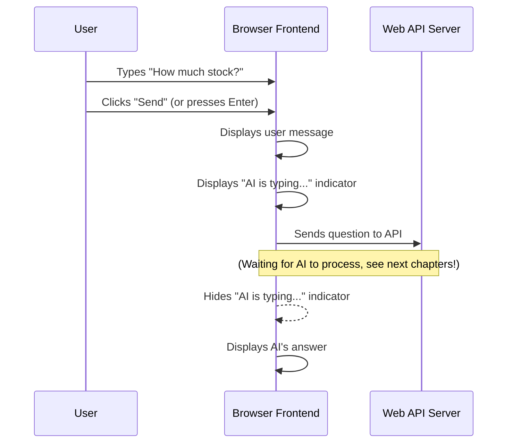

# Chapter 1: User Interface (Frontend)

Welcome to your journey into building a chatbot! We're starting at the very beginning, with what you'll see and touch: the **User Interface**, often called the **Frontend**.

Imagine you're chatting with a friend online. You see a chat window, you type your message, and your friend's reply pops up. That's exactly what the Frontend is for our chatbot! It's the "face" of our project, the part that you, the user, directly interact with.

## What is the Frontend? Why do we need it?

Our chatbot project is designed to help you ask questions about inventory (like "How many blue widgets do we have?"). The Frontend is where you ask those questions and where the chatbot shows you the answers.

Think of it like this:

*   **You** have a question.
*   The **Frontend** gives you a place to type it.
*   The **Frontend** takes your question and sends it off to get an answer.
*   The **Frontend** receives the answer and displays it clearly for you.

Without a Frontend, our powerful chatbot brain would be like a super-smart robot with no way to talk to people!

Let's look at the main use case: **Asking a question and seeing the AI's response.**

## The Building Blocks of Our Frontend

Our Frontend is built using standard web technologies:

1.  **HTML (HyperText Markup Language):** This is the **structure** of our webpage. It's like the blueprint that tells the browser where everything goes: where the chat messages will appear, where the input box is, and where the "Send" button is located.
2.  **CSS (Cascading Style Sheets):** This is the **look and feel** of our webpage. It's like the interior design, adding colors, fonts, spacing, and making sure everything looks neat and user-friendly. It tells the browser *how* the HTML elements should appear.
3.  **JavaScript:** This is the **interactivity** of our webpage. It's the "brain" of the Frontend, making things happen. When you type, when you click "Send", or when a new message arrives – JavaScript handles all these dynamic actions. It's what allows the page to "talk" to the chatbot's "brain" in the background.

## How We Interact: Asking a Question

Let's trace what happens when you use our chatbot's Frontend:

1.  **You type your question:** You'll see a text box at the bottom of the screen. You type something like "What is the stock level for item A?".
2.  **You send the question:** You either click the "Send" button or press Enter on your keyboard.
3.  **The Frontend reacts:** Your question immediately appears in the chat area, just like in a regular chat application.
4.  **The AI thinks:** A little "typing indicator" (like three bouncing dots) appears, letting you know the AI is working on an answer.
5.  **The AI replies:** After a moment, the AI's answer pops up, often with extra details like a "confidence level" or an "insight" to help you understand better. You might even see a button to reveal the "raw JSON" data, which is how the computer sees the answer.

Here's a simple diagram of this interaction:



In this diagram, the `Browser Frontend` is our [User Interface (Frontend)](01_user_interface__frontend__.md). It sends your question to the `Web API Server`, which is the topic of our next chapter: [Web API Server](02_web_api_server_.md).

## Under the Hood: The `index.html` File

All the magic for our Frontend lives primarily in a single file: `index.html`. This file contains the HTML structure, the CSS styling (within `<style>` tags), and the JavaScript logic (within `<script>` tags).

Let's look at key parts of `index.html`.

### The Chat Area (HTML Structure)

The main part of our Frontend is the chat area where messages appear.

```html
<div id="chat-area">
  <div class="welcome" id="welcome-screen">
    <!-- Welcome message and suggestions go here -->
  </div>
</div>
```

The `chat-area` is where all the user questions and AI answers will be added dynamically by JavaScript. Initially, it shows a `welcome-screen`.

When you type a question, JavaScript adds a new `div` (a rectangular box on the page) for your message:

```html
<div class="msg user">
  <div class="msg-label">you</div>
  <div class="bubble">What is the total inventory value?</div>
</div>
```

*   `class="msg user"`: This tells CSS to style it as a user message (e.g., align it to the right, give it a specific background color).
*   `msg-label`: A small label showing "you".
*   `bubble`: The actual text of your question, wrapped in a "chat bubble" style.

Similarly, an AI message would have `class="msg ai"` and show "inventory ai" as its label.

### The Input and Send Button (HTML Structure)

At the bottom of the page, you'll find the input area:

```html
<div id="input-area">
  <textarea
    id="question-input"
    rows="1"
    placeholder="Ask about inventory..."
  ></textarea>
  <button id="send-btn" onclick="sendQuestion()">Send ↗</button>
</div>
```

*   `textarea`: This is where you type your question. The `id="question-input"` lets JavaScript easily find and read what you've typed.
*   `button`: This is the "Send" button. Notice `onclick="sendQuestion()"`. This tells the browser: "When someone clicks this button, run the `sendQuestion` function in our JavaScript."

### Making It Pretty (CSS Styling)

While we won't dive deep into the CSS code here (it's quite a lot!), it's important to know what it does. All the code inside the `<style>` tags at the top of `index.html` is CSS.

For example, the CSS defines things like:

*   The background color of the whole page (`body { background: var(--bg); }`).
*   How user messages look versus AI messages (`.msg.user .bubble { background: var(--user-bg); }` vs. `.msg.ai .bubble { background: var(--ai-bg); }`).
*   The animations for the typing indicator or how new messages fade in.

The CSS ensures our chatbot is not just functional but also pleasant to look at and easy to read.

### Bringing it to Life (JavaScript Logic)

The JavaScript part, located within the `<script>` tags at the bottom of `index.html`, makes our Frontend dynamic.

Here's the core `sendQuestion` function, simplified:

```javascript
async function sendQuestion() {
  const userQuestion = input.value.trim(); // 1. Get user's text
  if (!userQuestion) return; // Don't send empty questions

  addUserMsg(userQuestion); // 2. Display user's question
  addTypingIndicator();     // 3. Show "AI is typing..."

  // 4. Send the question to the Web API Server
  try {
    const response = await fetch("http://localhost:8000/ask", {
      method: 'POST',
      headers: { 'Content-Type': 'application/json' },
      body: JSON.stringify({ question: userQuestion })
    });

    const rawData = await response.text(); // Get raw response
    removeTyping();                       // 5. Hide typing indicator

    if (!response.ok) {
      addErrorMsg(`Error: ${rawData}`); // 6. Display error if something went wrong
    } else {
      const parsedData = JSON.parse(rawData); // Convert text to a JavaScript object
      addAIMsg(parsedData, rawData);        // 7. Display AI's answer
    }
  } catch (error) {
    removeTyping();
    addErrorMsg(`Could not connect: ${error.message}`); // 8. Handle network errors
  }

  input.value = ''; // Clear the input box
  // Other lines to re-enable button and focus input...
}
```

Let's break down `sendQuestion()` even further:

1.  **`const userQuestion = input.value.trim();`**: This line gets the text you typed into the `textarea` (which has the `id="question-input"`). `.trim()` removes any extra spaces from the beginning or end.
2.  **`addUserMsg(userQuestion);`**: This JavaScript function creates the HTML for your message (like the `div` with `class="msg user"`) and adds it to the `chat-area`.
3.  **`addTypingIndicator();`**: This function creates and displays the little bouncing dots to show the AI is busy.
4.  **`fetch(...)`**: This is the most crucial part for connecting to the chatbot's "brain"! It sends your question to a specific address on your computer (`http://localhost:8000/ask`).
    *   `method: 'POST'`: We're sending data.
    *   `body: JSON.stringify({ question: userQuestion })`: We package your question into a special format called JSON (JavaScript Object Notation), which is a common way for computers to exchange data.
5.  **`removeTyping();`**: Once we get a response (or an error), we hide the typing indicator.
6.  **`if (!response.ok)` / `addErrorMsg(...)`**: If the server sends back an error (like a "404 Not Found" or "500 Internal Server Error"), we show a red error message.
7.  **`const parsedData = JSON.parse(rawData);` / `addAIMsg(parsedData, rawData);`**: If everything goes well, the server sends back a JSON string. `JSON.parse()` converts this string into a JavaScript object that we can easily work with. `addAIMsg()` then takes this data and formats it nicely into an AI chat bubble, showing the answer, confidence, and maybe other details.
8.  **`catch (error)`**: This part handles situations where the `fetch` call itself fails, for example, if the [Web API Server](02_web_api_server_.md) isn't even running.

The `addUserMsg` and `addAIMsg` functions internally use code like this to build the HTML for the messages:

```javascript
function addUserMsg(text) {
  // Hide welcome screen if it's there
  if (welcome) welcome.style.display = 'none';

  const msg = document.createElement('div'); // Create a new HTML div
  msg.className = 'msg user';                // Add CSS classes
  msg.innerHTML = `
    <div class="msg-label">you</div>
    <div class="bubble">${escHtml(text)}</div>
  `; // Set the content inside the div
  chatArea.appendChild(msg); // Add this new div to the chat area
  // scrollBottom(); // Scroll to the newest message
}

// Similar logic for addAIMsg, but it parses the AI data
// and creates a more complex bubble with confidence, insights, etc.
```

These functions use standard JavaScript features to dynamically create new HTML elements on the fly, which is how chat applications update without needing to refresh the entire page.

## Conclusion

In this chapter, we've explored the **User Interface (Frontend)** of our chatbot. This is the part users see and interact with, providing the chat window, input box, and the display for AI responses. We learned that HTML provides the structure, CSS adds the styling, and JavaScript handles all the dynamic actions, like sending your questions and displaying the AI's answers.

You now understand how your questions are captured and prepared to be sent off. But where do they go next? They go to the **Web API Server**, which is the next piece of our chatbot puzzle!

[Next Chapter: Web API Server](02_web_api_server_.md)

---

