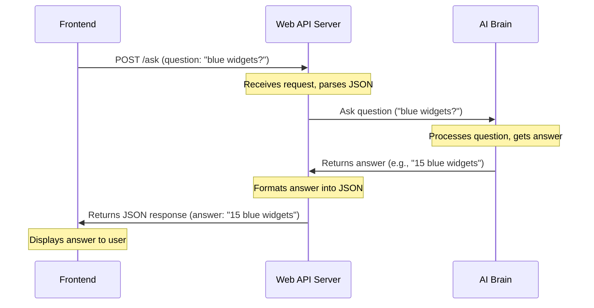

# Chapter 2: Web API Server

Imagine our chatbot application is a busy office building. The [User Interface (Frontend)](01_user_interface__frontend__.md) is like the visitor who walks in with a question. The **Web API Server** is the friendly receptionist at the front desk.

## What is the Web API Server? Why do we need it?

Our chatbot project has different "brains" that do specific tasks:
*   One part for asking the AI (the "AI Brain").
*   Another part for checking inventory data (the "Inventory Data Manager").

These different "brains" can't directly talk to your web browser. That's where the **Web API Server** comes in.

It acts as the central **receptionist** for our entire application:
*   It waits for requests from outside (like your web browser).
*   It understands what kind of request it is (e.g., "ask the AI a question" or "give me overall stats").
*   It directs the request to the correct internal "department" (the AI Brain or Inventory Data Manager).
*   It takes the answer from the internal department, packages it nicely, and sends it back to the original requester (your web browser).

Without the Web API Server, our Frontend would have no one to talk to! It's the essential bridge between what the user sees and what the chatbot actually *does*.

Let's revisit our main use case: **Asking a question and getting the AI's response.**

## Introducing FastAPI: Our Super Receptionist

To build our Web API Server, we use a Python tool called **FastAPI**. Think of FastAPI as a special toolkit that helps us quickly set up our "reception desk" and define all the "service windows" (which we call **endpoints**).

FastAPI is great because:
*   It's *fast* (as the name suggests).
*   It's *easy to use* for beginners.
*   It automatically helps us document our API.

## The "Desks" (Endpoints) of Our Server

Our Web API Server has different "desks" or "service windows," each designed to handle a specific type of request. These are called **endpoints**.

Here are the main endpoints for our chatbot:

| Endpoint      | What it does                                                                           | Type of Request | Analogy                                       |
| :------------ | :------------------------------------------------------------------------------------- | :-------------- | :-------------------------------------------- |
| `/ask`        | Takes your question, sends it to the AI, and returns the AI's answer.                  | `POST`          | The "Ask AI" service window.                  |
| `/stats`      | Provides general summary statistics about our inventory data.                          | `GET`           | The "Inventory Overview" service window.      |
| `/health`     | A simple check to see if the server is up and running.                                 | `GET`           | The "Are You Open?" sign.                     |

*   **`POST` requests** are usually for sending data to the server (like your question).
*   **`GET` requests** are usually for asking the server to *get* you some information.

## How the Frontend Talks to the Web API Server

Remember from Chapter 1, the `fetch` function in our Frontend's JavaScript?

```javascript
// From index.html (simplified)
async function sendQuestion() {
  const userQuestion = input.value.trim();

  // ... display user message, show typing indicator ...

  try {
    const response = await fetch("http://localhost:8000/ask", {
      method: 'POST',
      headers: { 'Content-Type': 'application/json' },
      body: JSON.stringify({ question: userQuestion }) // Your question packed as JSON
    });

    // ... process response, display AI answer ...
  } catch (error) {
    // ... handle errors ...
  }
}
```

This `fetch` call is the Frontend making a request to our Web API Server:
*   `"http://localhost:8000/ask"`: This is the "address" of our server and the specific `/ask` endpoint it wants to talk to.
    *   `localhost`: Means "your own computer."
    *   `8000`: Is the "port number" – like a specific door on your computer where the server is listening.
*   `method: 'POST'`: Tells the server we are sending data (your question).
*   `body: JSON.stringify({ question: userQuestion })`: We package your question into a special text format called **JSON** (JavaScript Object Notation). This is a very common way for different computer systems to exchange data.

## Step-by-Step: Asking the AI Through the Server

Let's trace what happens when you ask our chatbot a question, from the moment you click "Send" to when you see the answer:

1.  **You ask a question:** You type "How many red items are there?" and click "Send" on the [User Interface (Frontend)](01_user_interface__frontend__.md).
2.  **Frontend prepares the request:** The Frontend's JavaScript takes your question and turns it into a JSON message like `{"question": "How many red items are there?"}`.
3.  **Frontend sends to the Server:** The Frontend uses `fetch` to send this JSON message as a `POST` request to `http://localhost:8000/ask`.
4.  **Web API Server receives the request:** Our FastAPI server receives this `POST` request at its `/ask` endpoint.
5.  **Server processes the question:** The server unpacks the JSON, sees your question, and passes it along to the [AI Brain / LLM Interface](04_ai_brain___llm_interface__.md) for processing. It also might gather some data from the [Inventory Data Manager](03_inventory_data_manager_.md) to help the AI.
6.  **AI Brain thinks:** The AI processes the question and comes up with an answer, like `{"answer": "There are 20 red items.", "confidence": 0.95}`.
7.  **Server sends back the answer:** The Web API Server receives the AI's answer, packages it back into a JSON response, and sends it back to the Frontend.
8.  **Frontend displays the answer:** The Frontend receives the JSON response, reads the answer, and displays it in the chat window for you to see!

Here's a diagram of this interaction:



## Under the Hood: Our `main.py` Server Code

All the logic for our Web API Server lives primarily in a file called `main.py`. This is where we tell FastAPI to set up our reception desk and define our endpoints.

Let's look at key parts of `main.py`.

### Setting up FastAPI and CORS

```python
# --- File: main.py (simplified) ---
from fastapi import FastAPI, HTTPException
from fastapi.middleware.cors import CORSMiddleware # Important for web browsers!

app = FastAPI(title="Inventory AI", version="0.3.0")

app.add_middleware(
    CORSMiddleware,
    allow_origins=["*"], # Allows any web browser to connect
    allow_methods=["*"],
    allow_headers=["*"],
    expose_headers=["*"],
)
```

1.  `from fastapi import FastAPI`: This line imports the `FastAPI` tool we need.
2.  `app = FastAPI(...)`: This creates our "receptionist" application. We give it a `title` and `version`.
3.  `app.add_middleware(CORSMiddleware, ...)`: This is very important for web applications!
    *   **CORS (Cross-Origin Resource Sharing)** is a security feature built into web browsers. It usually stops a website from `http://localhost:5500` (where our Frontend might be running) from talking to a server at `http://localhost:8000` (where our API Server is).
    *   `CORSMiddleware` tells the browser: "It's okay, this server explicitly allows requests from any origin (`allow_origins=["*"]`)!" This lets our Frontend and Backend communicate without security blocks.

### The `/ask` Endpoint: Handling Questions

```python
# --- File: main.py (simplified) ---
# ... (imports and app setup) ...
from models import QueryRequest, QueryResponse # Data formats from next chapters!
from data_loader import get_data_as_text      # To get inventory data
from ai import ask                            # To talk to the AI brain

@app.post("/ask", response_model=QueryResponse)
def ask_inventory(req: QueryRequest):
    """Non-streaming JSON response."""
    if not req.question.strip():
        raise HTTPException(status_code=400, detail="Question empty.")

    inventory_data = get_data_as_text() # Get data from our Inventory Data Manager
    result = ask(req.question, inventory_data) # Ask the AI Brain
    return QueryResponse(**result) # Format and send the AI's answer
```

1.  `@app.post("/ask", response_model=QueryResponse)`: This line is a "decorator" that tells FastAPI:
    *   "This function (`ask_inventory`) should run when a `POST` request comes to the `/ask` address."
    *   `response_model=QueryResponse`: It also tells FastAPI that the *response* this endpoint sends back will be in the format defined by our `QueryResponse` from [API Data Models](05_api_data_models_.md).
2.  `def ask_inventory(req: QueryRequest):`: This is the function that handles the request.
    *   `req: QueryRequest`: FastAPI automatically takes the JSON that the Frontend sent (like `{"question": "..."}`) and turns it into a Python object called `req` that follows our `QueryRequest` format from [API Data Models](05_api_data_models_.md). This ensures we get a valid question.
3.  `if not req.question.strip():`: Basic check to make sure the question isn't empty. If it is, we send back an `HTTPException` (an error message).
4.  `inventory_data = get_data_as_text()`: This calls a function from our `data_loader` (which is part of our [Inventory Data Manager](03_inventory_data_manager_.md)) to load the inventory information that the AI needs to answer questions.
5.  `result = ask(req.question, inventory_data)`: This is where we talk to the AI! We pass the user's `question` and the `inventory_data` to the `ask` function, which is located in our `ai` module (our [AI Brain / LLM Interface](04_ai_brain___llm_interface_.md)).
6.  `return QueryResponse(**result)`: Finally, we take the `result` from the AI, make sure it matches the `QueryResponse` format from [API Data Models](05_api_data_models_.md), and send it back to the Frontend as JSON.

### Other Endpoints: Stats and Health

The other endpoints are simpler as they only retrieve information.

```python
# --- File: main.py (simplified) ---
# ... (imports and app setup) ...
from data_loader import get_summary_stats # To get summary data

@app.get("/stats")
def stats():
    """Returns summary stats."""
    return get_summary_stats() # Get stats from our Inventory Data Manager

@app.get("/health")
def health():
    """Simple health check."""
    return {"status": "ok", "model": "mistral", "data_source": "csv/excel"}
```

1.  `@app.get("/stats")`: This tells FastAPI to run the `stats` function when a `GET` request comes to the `/stats` address.
    *   `return get_summary_stats()`: This calls a function from our `data_loader` (part of [Inventory Data Manager](03_inventory_data_manager_.md)) to fetch and return some summary statistics.
2.  `@app.get("/health")`: Similarly, this handles `GET` requests to `/health`.
    *   `return {"status": "ok", ...}`: This simply returns a small JSON dictionary showing that the server is working and what kind of AI model it's using. This is useful for checking if the server is alive.

## Conclusion

You've now learned about the **Web API Server**, our chatbot's central receptionist! It's the critical link that receives requests from the [User Interface (Frontend)](01_user_interface__frontend__.md), directs them to the right "departments" (like the AI or data managers), and sends back the neatly packaged answers. We use FastAPI to build this server, making it efficient and easy to define different "desks" (endpoints) like `/ask`, `/stats`, and `/health`.

The Web API Server relies on other parts of our chatbot to do its job, especially getting data and talking to the AI. In our next chapter, we'll dive into the **Inventory Data Manager**, which is responsible for handling all the product information our chatbot needs.

[Next Chapter: Inventory Data Manager](03_inventory_data_manager_.md)

---
