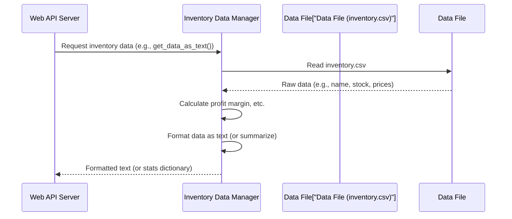

# Chapter 3: Inventory Data Manager

Imagine your chatbot is a smart employee in a warehouse. This employee needs to answer questions like "How many blue widgets do we have?" or "What's the profit margin on item X?". To do this, they need accurate, up-to-date information about all the products. That's exactly what the **Inventory Data Manager** does!

## What is the Inventory Data Manager? Why do we need it?

The Inventory Data Manager is like the **librarian** for all our product and stock information. It's dedicated to managing our inventory data, making sure it's always ready and easy for other parts of the system (especially the AI) to understand and use.

Here's why our chatbot needs this "librarian":

1.  **Data lives in files:** Our raw inventory data might be stored in a spreadsheet file (like `inventory.csv` or `inventory.xlsx`). The chatbot needs a way to read this information.
2.  **Raw data isn't always ready:** The raw data might just have "buy price" and "sell price." The AI or an internal report might need "profit margin" or "profit per unit." The librarian calculates these.
3.  **AI needs specific formats:** The [AI Brain / LLM Interface](04_ai_brain___llm_interface__.md) works best when information is presented in a clear, consistent text format. The librarian converts complex tables into simple text blocks.
4.  **Quick summaries are useful:** Sometimes we don't need all the details, just quick stats like "total number of items" or "average profit margin." The librarian can provide these summaries.

Without the Inventory Data Manager, the AI would be "blind" to our inventory, and our server wouldn't be able to provide useful statistics.

Let's look at a core use case: **The Web API Server needs inventory data for the AI or for a summary.**

## Key Tasks of Our Inventory Data Manager

Our "librarian" performs a few crucial tasks:

1.  **Loading Data**: It knows where to find the inventory files (like `inventory.csv`) and how to read them.
2.  **Processing & Organizing Data**: It takes the raw data and adds more useful information, like calculating the profit margin for each item. This makes the data more helpful.
3.  **Summarizing Data**: It can quickly generate overall statistics (like total items or average profit) or convert all the detailed inventory into a simple, easy-to-read text format for the AI.

## How the Web API Server Uses the Inventory Data Manager

Remember from [Web API Server](02_web_api_server_.md), our FastAPI server has two main endpoints that need inventory information:

*   The `/ask` endpoint (when you ask the AI a question) needs a detailed text description of all inventory.
*   The `/stats` endpoint needs a summary of key inventory statistics.

The Inventory Data Manager provides exactly what these endpoints need!

### Example: Getting Data for the AI (`get_data_as_text`)

When the [Web API Server](02_web_api_server_.md) receives a question via `/ask`, it calls a function from our Inventory Data Manager called `get_data_as_text()`.

*   **Input**: None (it knows where the data file is).
*   **Output**: A long string of text, where each line describes an inventory item.

Here's an example of what the AI would "read":

```text
- [Hardware] Bolt M8 | Stock: 500 pcs | Buy: ₹2.5 | Sell: ₹5.0 | Margin: 100.0% | Profit/unit: ₹2.5 | Reorder at: 100 | Supplier: FastenCo
- [Piping] Valve 2in | Stock: 80 pcs | Buy: ₹120.0 | Sell: ₹195.0 | Margin: 62.5% | Profit/unit: ₹75.0 | Reorder at: 20 | Supplier: PipePro Ltd
... (many more lines for other items) ...
```

This format is perfect for the [AI Brain / LLM Interface](04_ai_brain___llm_interface__.md) to understand the inventory.

### Example: Getting Summary Statistics (`get_summary_stats`)

When the [Web API Server](02_web_api_server_.md) receives a request via `/stats`, it calls another function from our Inventory Data Manager called `get_summary_stats()`.

*   **Input**: None.
*   **Output**: A dictionary (a collection of `key: value` pairs) containing various summary numbers.

Here's an example of what the `/stats` endpoint would get:

```json
{
  "total_items": 10,
  "total_stock_value": 110830.0,
  "avg_margin_pct": 82.6,
  "low_stock_items": ["Valve 2in", "Pump Motor 1HP", "Pressure Gauge"],
  "top_margin_item": "Bolt M8",
  "categories": ["Hardware", "Piping", "Sealing", "Electrical", "Tools", "Safety", "Instruments", "Consumables"]
}
```

This is very useful for quickly checking the overall health of our inventory.

## Under the Hood: The `data_loader.py` File

All the "librarian's" work happens in a Python file named `data_loader.py`. Let's see how it's structured.

### Step-by-Step: From File to Formatted Data

Here's how the Inventory Data Manager processes information:

1.  **Request from Web API Server**: The [Web API Server](02_web_api_server_.md) asks for inventory data (either for the AI or for statistics).
2.  **Load Raw Data**: The Inventory Data Manager first reads the `inventory.csv` (or `.xlsx`) file.
3.  **Calculate New Information**: It immediately calculates useful things like "profit margin" and "profit per unit" for each item.
4.  **Format/Summarize**: Depending on what the [Web API Server](02_web_api_server_.md) asked for, it then either converts the data into a long text string or calculates summary statistics.
5.  **Return to Web API Server**: The formatted data or statistics are sent back to the [Web API Server](02_web_api_server_.md).

Here's a diagram of this process:



### The `load_data()` Function: Reading and Organizing

The heart of our librarian is the `load_data()` function. It reads the data and makes the first set of important calculations. We use a powerful Python library called **Pandas** to work with tables of data (DataFrames).

```python
# --- File: data_loader.py (simplified) ---
import pandas as pd # The Pandas library helps us work with tables

DATA_PATH = "data/inventory.csv" # Our inventory file

def load_data() -> pd.DataFrame:
    """
    Loads data from CSV or Excel and calculates profit metrics.
    """
    # For simplicity, we'll assume CSV here.
    # The actual code checks for .xlsx too!
    df = pd.read_csv(DATA_PATH)

    # Calculate profit margin percentage
    df["margin_pct"] = round(
        ((df["sell_price"] - df["buy_price"]) / df["buy_price"]) * 100, 1
    )
    # Calculate profit per unit
    df["profit_per_unit"] = df["sell_price"] - df["buy_price"]

    return df
```

**Explanation:**

1.  `import pandas as pd`: This line brings in the Pandas library, which is excellent for handling spreadsheet-like data.
2.  `DATA_PATH`: This variable simply points to where our `inventory.csv` file is located.
3.  `df = pd.read_csv(DATA_PATH)`: This is where Pandas reads our CSV file and turns it into a `DataFrame`. Think of a DataFrame as a table with rows and columns, just like your spreadsheet.
4.  `df["margin_pct"] = ...`: Here, we add a brand new column to our table called `margin_pct`. For each row, it calculates the profit margin using the `sell_price` and `buy_price`.
5.  `df["profit_per_unit"] = ...`: Similarly, we add a `profit_per_unit` column.
6.  `return df`: The function then gives back this enhanced table (DataFrame) with the new calculated columns.

### The `get_data_as_text()` Function: Preparing for the AI

This function takes the processed data from `load_data()` and converts it into a human-readable (and AI-readable) text format.

```python
# --- File: data_loader.py (simplified) ---
# ... (imports and load_data function) ...

def get_data_as_text() -> str:
    """Convert dataframe into a readable text block for AI prompt."""
    df = load_data() # First, get the processed data

    lines = []
    # Loop through each item (row) in our inventory table
    for _, row in df.iterrows():
        # Create a descriptive line for each item
        lines.append(
            f"- [{row['category']}] {row['name']} | "
            f"Stock: {row['stock']} {row.get('unit','pcs')} | "
            f"Margin: {row['margin_pct']}%" # Simplified for brevity
        )
    return "\n".join(lines) # Join all lines into one big text string
```

**Explanation:**

1.  `df = load_data()`: It first calls `load_data()` to get the inventory table, complete with calculated profit margins.
2.  `lines = []`: An empty list is created to store each line of our descriptive text.
3.  `for _, row in df.iterrows():`: This loop goes through each row (each item) in our inventory table. `row` here is like a mini-dictionary for one item.
4.  `lines.append(...)`: For each item, it builds a formatted string using the item's details (category, name, stock, margin, etc.) and adds it to our `lines` list.
5.  `return "\n".join(lines)`: Finally, all the individual lines are joined together with a newline character (`\n`) in between, creating one large block of text.

### The `get_summary_stats()` Function: Quick Insights

This function also uses the `load_data()` output but calculates overall statistics instead of individual item descriptions.

```python
# --- File: data_loader.py (simplified) ---
# ... (imports, load_data, get_data_as_text functions) ...

def get_summary_stats() -> dict:
    """Calculates quick summary statistics for the /stats endpoint."""
    df = load_data() # Get the processed inventory data

    return {
        "total_items": len(df), # Count how many items (rows) we have
        "total_stock_value": round((df["stock"] * df["buy_price"]).sum(), 2), # Total value of all stock
        "avg_margin_pct": round(df["margin_pct"].mean(), 1), # Average profit margin
        "top_margin_item": df.loc[df["margin_pct"].idxmax(), "name"], # Name of item with highest margin
    }
```

**Explanation:**

1.  `df = load_data()`: Again, it starts by getting the prepared inventory table.
2.  `return { ... }`: It then creates a Python dictionary.
    *   `len(df)`: Gives the total number of items.
    *   `(df["stock"] * df["buy_price"]).sum()`: Calculates the total value of all stock by multiplying stock by buy price for each item and summing them up.
    *   `df["margin_pct"].mean()`: Calculates the average of the `margin_pct` column.
    *   `df.loc[df["margin_pct"].idxmax(), "name"]`: This is a bit advanced, but it finds the row with the maximum `margin_pct` and then gets its `name`.
3.  All these calculated values are returned in a neat dictionary.

## Conclusion

You've now explored the **Inventory Data Manager**, our chatbot's diligent librarian! This crucial component is responsible for loading raw inventory data, processing it with useful calculations like profit margins, and then preparing it in different formats: either as a detailed text block for the [AI Brain / LLM Interface](04_ai_brain___llm_interface__.md) or as quick summary statistics for the [Web API Server](02_web_api_server_.md)'s `/stats` endpoint. Thanks to the Inventory Data Manager, our chatbot always has access to the organized and understandable information it needs.

Now that our data is prepared and ready, it's time to send it to the real "brain" of the operation. In our next chapter, we'll dive into the **AI Brain / LLM Interface**, which takes questions and data and generates intelligent answers!

[Next Chapter: AI Brain / LLM Interface](04_ai_brain___llm_interface__.md)

---
