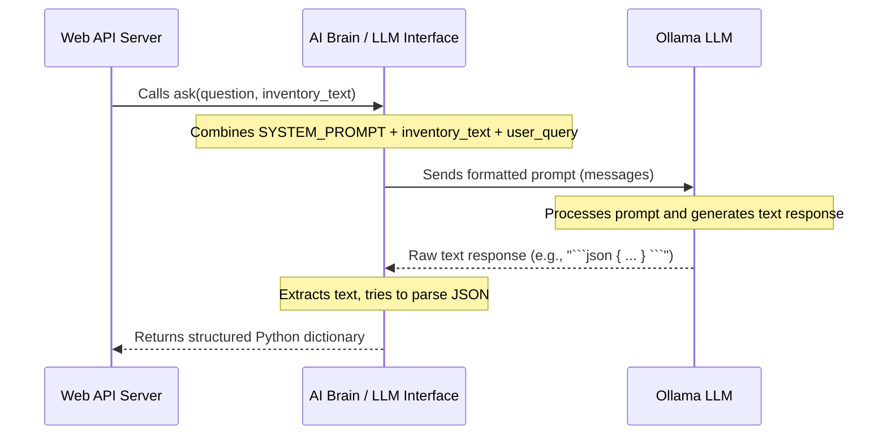

# Chapter 4: AI Brain / LLM Interface

### This is where the **AI Brain / LLM Interface** comes in!

Imagine your chatbot is a foreign exchange student. The [User Interface (Frontend)](01_user_interface__frontend__.md) is where you, the user, speak your native language. The [Web API Server](02_web_api_server_.md) is like the interpreter who hears your question. The [Inventory Data Manager](03_inventory_data_manager_.md) is like a helpful textbook full of facts. But you need someone who can *understand* your question, *read* the textbook, and then *formulate a thoughtful answer*.

The **AI Brain / LLM Interface** is precisely that intelligent student! It's the "translator" and "speaker" for our intelligent assistant, enabling it to communicate with a powerful Large Language Model (LLM) like Ollama.

## What is the AI Brain / LLM Interface? Why do we need it?

Our chatbot project needs a way to actually *understand* natural language questions (like "How many blue widgets are in stock?") and *generate* intelligent answers based on the provided inventory data. This is a complex task that a regular computer program can't easily do.

That's where **Large Language Models (LLMs)** come in. Think of an LLM as an incredibly vast and powerful text prediction engine. You give it some text (a "prompt"), and it tries to continue the text in a meaningful way.

Our **AI Brain / LLM Interface** is the specialized part of our chatbot that knows how to:

1.  **Talk to an LLM**: It knows how to send messages to the LLM (like Ollama, which runs locally on your computer).
2.  **Format Questions for the LLM**: LLMs don't just take a raw question. They need context! Our interface packages the user's question *and* the relevant inventory data into a clear "message" the LLM can understand.
3.  **Translate LLM Answers**: LLMs can be a bit chatty and might give answers in various styles. Our interface takes the LLM's free-form answer and tries its best to structure it into a neat, consistent **JSON** format that the rest of our application can easily use.

Without this interface, our chatbot would have no intelligence! It couldn't understand complex questions or generate helpful, human-like responses.

Let's look at the main use case: **Taking a user's question and inventory data, sending it to the AI, and getting a structured JSON response.**

## Key Concepts of the AI Brain / LLM Interface

### 1. Large Language Models (LLMs)

*   **What they are:** LLMs are advanced artificial intelligence models trained on massive amounts of text data (books, websites, etc.). This training allows them to understand, generate, and process human-like text.
*   **How they work (simply):** You give them a "prompt" (your instruction or question), and they try to predict the most appropriate next words to complete a response.
*   **Ollama:** For our project, we use Ollama, a fantastic tool that lets us run powerful LLMs (like `mistral`) right on our own computer. This means our AI doesn't need to connect to the internet to work!

### 2. Prompt Engineering

*   **What it is:** This is the art and science of crafting the perfect input (the "prompt") to guide an LLM to produce the desired output.
*   **Why it's important:** If you just say "What is inventory?", the LLM might give a general definition. But if you say "You are an inventory assistant. Here is my inventory data. Based on this, what is the stock level of item X? Always respond in JSON.", the LLM is much more likely to give a specific, relevant, and formatted answer.
*   **Components of our prompt:**
    *   **System Prompt**: Tells the LLM its role (e.g., "You are an intelligent inventory assistant."). This sets the "personality" and rules.
    *   **User Question**: The actual question from the user.
    *   **Inventory Data**: The neatly formatted text about our inventory, provided by the [Inventory Data Manager](03_inventory_data_manager_.md).

### 3. JSON Structuring and Parsing

*   **The challenge:** LLMs are great at generating free-form text. But for our application, we need answers in a predictable format so our code can easily extract the `answer`, `confidence`, and `data`.
*   **The solution:** We instruct the LLM in our prompt to *always* respond in JSON. Our AI Brain then tries to "parse" (read and understand) this JSON. If the LLM doesn't follow instructions perfectly, our interface has a plan B to still provide some kind of answer.

## How to Use: Asking the AI

From the perspective of the [Web API Server](02_web_api_server_.md), using the AI Brain is very straightforward. It simply calls a function in our `ai.py` file:

```python
# From main.py (Web API Server, simplified)
# ... (imports) ...
from ai import ask # To talk to the AI brain

def ask_inventory(req: QueryRequest):
    # ... (get inventory_data) ...

    # This is how the Web API Server uses the AI Brain:
    result = ask(req.question, inventory_data)
    # result will be a Python dictionary matching our expected JSON structure

    return QueryResponse(**result)
```

**Example Input and Output:**

Let's say `user_query` is `"How many blue bolts are there?"` and `inventory_data` is a long string describing inventory items, including:

```text
- [Hardware] Bolt M8 blue | Stock: 50 pcs | ...
- [Hardware] Bolt M8 red | Stock: 100 pcs | ...
```

When `ask("How many blue bolts are there?", inventory_data)` is called, the AI Brain / LLM Interface will handle everything and return a Python dictionary like this:

```python
{
  "answer": "There are 50 blue Bolt M8 items in stock.",
  "data": [{"item": "Bolt M8 blue", "stock": 50}],
  "insight": "Blue bolts are available.",
  "confidence": "high"
}
```

This structured dictionary is then sent back to the [User Interface (Frontend)](01_user_interface__frontend__.md) by the [Web API Server](02_web_api_server_.md).

## Under the Hood: The `ai.py` File

All the magic of our AI Brain / LLM Interface happens in a Python file named `ai.py`. Let's explore how it works step-by-step.

### Step-by-Step: From Question to Structured Answer

Here's what happens inside the AI Brain / LLM Interface when the `ask` function is called:

1.  **Receive Inputs**: It gets the `user_query` (your question) and `inventory_text` (the data from [Inventory Data Manager](03_inventory_data_manager_.md)).
2.  **Build the "Conversation"**: It combines a `SYSTEM_PROMPT` (telling the AI its role and rules) with the `inventory_text` and `user_query` into a structured list of messages, ready for the LLM.
3.  **Send to Ollama LLM**: It uses the `ollama` Python library to send these messages to the running Ollama model (e.g., `mistral`) on your computer.
4.  **Get Raw AI Response**: Ollama processes the messages and sends back its generated text. This text might include things like "```json" or "```" around the actual JSON.
5.  **Clean Up Response**: The interface removes any extra formatting (like those "```json" markers) from the raw text.
6.  **Parse JSON**: It attempts to convert this cleaned text into a Python dictionary using `json.loads()`.
7.  **Handle Errors & Return**:
    *   If the JSON parsing succeeds, it returns the neat dictionary.
    *   If the LLM didn't give perfect JSON, it catches the error and returns a fallback dictionary with the raw answer and a "low confidence" warning.

Here's a diagram showing this flow:



### The `SYSTEM_PROMPT`: Setting the Rules

The `SYSTEM_PROMPT` is a crucial part of guiding the LLM. It defines its role and, most importantly, tells it to respond in a specific JSON format.

```python
# --- File: ai.py (simplified) ---
SYSTEM_PROMPT = """
You are an intelligent inventory assistant for a company.
You have access to inventory data below.
Always respond in valid JSON format with this structure:
{
  "answer": "human-friendly explanation here",
  "data": [],
  "insight": "any useful observation",
  "confidence": "high | medium | low"
}
Never add text outside the JSON. Be conversational inside the answer field.
"""
```

**Explanation:**

*   `You are an intelligent inventory assistant...`: This sets the context and personality for the AI.
*   `Always respond in valid JSON format...`: This is a key instruction, telling the LLM *how* to format its output.
*   `Never add text outside the JSON.`: This helps prevent the LLM from adding chatter before or after the JSON block, making it easier for our code to parse.
*   `Be conversational inside the answer field.`: Guides the AI to make its answer friendly within the JSON.

### Building the Messages: `_build_messages`

This small helper function takes the user's question and inventory data and combines them with the `SYSTEM_PROMPT` into a format that the `ollama` library expects.

```python
# --- File: ai.py (simplified) ---
# ... (SYSTEM_PROMPT) ...

def _build_messages(user_query: str, inventory_text: str):
    return [
        {"role": "system", "content": SYSTEM_PROMPT},
        {"role": "user",   "content": f"INVENTORY DATA:\n{inventory_text}\n\nUSER QUESTION: {user_query}\n\nRespond ONLY in JSON."}
    ]
```

**Explanation:**

*   `{"role": "system", "content": SYSTEM_PROMPT}`: This is the first message, setting the stage.
*   `{"role": "user", "content": f"INVENTORY DATA:\n{inventory_text}\n\nUSER QUESTION: {user_query}\n\nRespond ONLY in JSON."}`: This is the actual question from the user, combined with the detailed inventory data. Notice how we reiterate "Respond ONLY in JSON" here, as repetition often helps LLMs follow instructions better.

### Asking the LLM and Parsing the Response: `ask` Function

This is the core function that orchestrates sending the message to Ollama and then processing its response.

```python
# --- File: ai.py (simplified) ---
import ollama
import json
import re
# ... (SYSTEM_PROMPT, _build_messages) ...

def ask(user_query: str, inventory_text: str) -> dict:
    """Non-streaming — full response at once."""
    response = ollama.chat(
        model="mistral", # We're using the 'mistral' model
        messages=_build_messages(user_query, inventory_text) # Our formatted prompt
    )
    raw = response["message"]["content"] # Get the AI's raw text response
    raw = re.sub(r"```json|```", "", raw).strip() # Remove any '```json' or '```'
    try:
        return json.loads(raw) # Try to convert the cleaned text to JSON
    except json.JSONDecodeError:
        # If it fails, return a fallback dictionary
        return {
            "answer": raw,
            "data": [],
            "insight": "Could not parse structured JSON from model.",
            "confidence": "low"
        }
```

**Explanation:**

1.  `response = ollama.chat(...)`: This is the crucial line where we send our `messages` to the `mistral` LLM using the `ollama` library.
2.  `raw = response["message"]["content"]`: The `ollama.chat` function returns a complex object, and the actual text content from the AI is found at `response["message"]["content"]`.
3.  `raw = re.sub(r"```json|```", "", raw).strip()`: LLMs sometimes wrap their JSON output in markdown code blocks (` ```json ... ``` `). This line uses `re.sub` (regular expressions) to find and remove these markers, leaving us with just the clean JSON string. `.strip()` removes any leading/trailing whitespace.
4.  `try...except json.JSONDecodeError`: This is a "safety net."
    *   `json.loads(raw)`: We attempt to convert the `raw` string (which we hope is clean JSON) into a Python dictionary.
    *   If `json.loads` succeeds, the dictionary is `return`ed.
    *   If `json.loads` fails (meaning the LLM didn't produce valid JSON despite our instructions), the `except` block catches the `JSONDecodeError`. In this case, we still return a dictionary, but it uses the raw response as the `answer` and marks the `confidence` as "low" and adds an `insight` about the parsing failure. This ensures our application always gets *some* response in the expected dictionary format, even if it's not perfectly structured.

### Streaming Answers (Optional `ask_stream`)

Our `ai.py` also includes an `ask_stream` function. This is for more advanced scenarios where you want the AI's answer to appear character by character in the [User Interface (Frontend)](01_user_interface__frontend__.md), rather than waiting for the whole response to be ready. It's often used for a more dynamic chat experience but works similarly to `ask` internally. We won't dive into its details here to keep things beginner-friendly.

## Conclusion

You've now uncovered the core intelligence of our chatbot: the **AI Brain / LLM Interface**! This component acts as the essential link between our application and a powerful Large Language Model like Ollama. It takes your questions and inventory data, carefully crafts a "prompt" for the AI, sends it off, and then crucially tries to format the AI's potentially free-form answer into a consistent JSON structure that our chatbot can easily understand and display.

This interface brings our chatbot to life, allowing it to process natural language and generate intelligent responses. Now that we understand how information is collected, processed, and responded to, in our final chapter, we'll look at the **API Data Models**, which ensure all these different parts of our application speak the same structured language!

[Next Chapter: API Data Models](05_api_data_models_.md)

---
