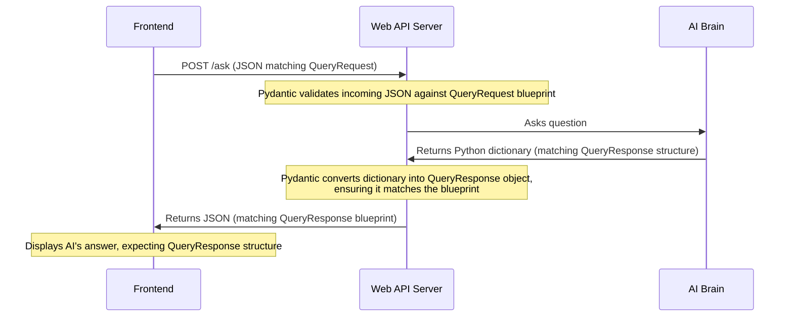

# Chapter 5: API Data Models
We've learned from the friendly face of our [User Interface (Frontend)](01_user_interface__frontend__.md) to the diligent [Inventory Data Manager](03_inventory_data_manager__.md), and into the smarts of the [AI Brain / LLM Interface](04_ai_brain___llm_interface__.md). Along the way, the [Web API Server](02_web_api_server_.md) has been our central "receptionist," directing traffic and bringing all these pieces together.

Now, imagine all these different parts are working in an orchestra. Each instrument plays its part, but they all need to read from the same sheet music to create a beautiful symphony. If the Frontend sends data in one format, and the AI expects it in another, there will be chaos!

This is where **API Data Models** come in. They are like the "standard sheet music" or **blueprints** that all parts of our chatbot agree upon for exchanging information.

## What are API Data Models? Why do we need them?

API Data Models are simply strict definitions of what our data should look like. They specify:
*   What pieces of information are expected.
*   What type of information each piece should be (e.g., text, numbers, a list).
*   Whether a piece of information is absolutely required or optional.

For our chatbot, these models define exactly what information should be included in a user's question and what structure the AI's answer will take.

### Why are they so important?

1.  **Prevent Misunderstandings (The "Contract"):** They act as a clear contract between different parts of our application. The Frontend promises to send questions in a certain way, and the Web API Server promises to send answers back in another specific way. Everyone knows what to expect!
2.  **Automatic Validation (The "Quality Check"):** When data comes into our [Web API Server](02_web_api_server_.md), these models automatically check if the data follows the blueprint. If something is missing or is the wrong type, the server can immediately say, "Hey, this data isn't right!"
3.  **Clear Documentation (The "User Manual"):** For any developer looking at our code, these models clearly show what data is being used. It's like having a user manual for our data.

Without API Data Models, our application would be prone to errors caused by unexpected data formats, making it much harder to build and maintain.

Our central use case: **Ensuring that the user's question arrives correctly and the AI's response is always in a predictable, easy-to-use format.**

## Introducing Pydantic: Our Blueprint Tool

To create these data models in Python, we use a fantastic library called **Pydantic**. Pydantic helps us define our "blueprints" easily and then does all the automatic checking for us.

## Key Data Models in Our Chatbot

For our chatbot, we define two main data models:

| Data Model      | Purpose                                                                                | Analogy                                   |
| :-------------- | :------------------------------------------------------------------------------------- | :---------------------------------------- |
| `QueryRequest`  | Defines the structure of the question sent *from* the Frontend *to* the Web API Server. | The "User's Question Form"                |
| `QueryResponse` | Defines the structure of the answer sent *from* the Web API Server *to* the Frontend.  | The "AI's Answer Sheet"                   |

Let's see how these blueprints are defined and used.

## How We Use API Data Models

Our data models live in a file called `models.py`.

### 1. `QueryRequest`: The User's Question Blueprint

When you type a question in the [User Interface (Frontend)](01_user_interface__frontend__.md) and click send, it sends a **JSON** message to our [Web API Server](02_web_api_server_.md). The `QueryRequest` model ensures that this JSON message always contains a `question` field, and that `question` must be a string (text).

Here's how it's defined in `models.py`:

```python
# --- File: models.py ---
from pydantic import BaseModel

class QueryRequest(BaseModel):
    question: str
```

**Explanation:**
*   `from pydantic import BaseModel`: This imports the `BaseModel` from Pydantic, which is the foundation for all our data models.
*   `class QueryRequest(BaseModel):`: We create a new blueprint named `QueryRequest`, which "inherits" capabilities from `BaseModel`.
*   `question: str`: This line defines that any data conforming to `QueryRequest` *must* have a field called `question`, and its value *must* be a string (`str`).

#### Using `QueryRequest` in the [Web API Server](02_web_api_server__.md)

Remember our `/ask` endpoint in `main.py`? It uses `QueryRequest` to ensure the incoming question is valid:

```python
# --- File: main.py (simplified snippet) ---
# ...
from models import QueryRequest # Import our blueprint

@app.post("/ask", response_model=QueryResponse)
def ask_inventory(req: QueryRequest): # <--- FastAPI uses QueryRequest here!
    """Non-streaming JSON response."""
    # FastAPI automatically takes the incoming JSON
    # and converts it into a 'req' object, checking if it matches QueryRequest.
    if not req.question.strip():
        raise HTTPException(status_code=400, detail="Question empty.")
    # ... rest of the function ...
```

**Explanation:**
*   `req: QueryRequest`: By simply adding `: QueryRequest` to the `req` parameter, FastAPI (which uses Pydantic internally) automatically knows to expect a JSON payload that matches our `QueryRequest` blueprint.
*   If the Frontend sends `{"user_question": "..."}` instead of `{"question": "..."}`, FastAPI will immediately send back an error because it doesn't match the `QueryRequest` blueprint. This is our automatic validation at work!

### 2. `QueryResponse`: The AI's Answer Blueprint

After the [AI Brain / LLM Interface](04_ai_brain___llm_interface__.md) processes the question, it returns a structured answer. The `QueryResponse` model defines what this answer should look like, making it easy for the Frontend to display.

Here's how it's defined in `models.py`:

```python
# --- File: models.py ---
from pydantic import BaseModel
from typing import Any, List # Used for specifying lists

# ... QueryRequest class ...

class QueryResponse(BaseModel):
    answer: str
    data: List[Any] = [] # A list that can hold anything
    insight: str = ""    # Optional text, default is empty string
    confidence: str = "medium" # Optional text, default is "medium"
```

**Explanation:**
*   `answer: str`: This is the main human-friendly text answer, and it *must* be a string.
*   `data: List[Any] = []`: This means there's an optional field called `data`, which will be a `List` (like a Python list or JavaScript array). `Any` means it can contain items of any type (e.g., numbers, strings, or even other dictionaries). If no `data` is provided, it defaults to an empty list `[]`.
*   `insight: str = ""`: This is an optional extra observation or tip, defaulting to an empty string.
*   `confidence: str = "medium"`: This indicates how sure the AI is about its answer, defaulting to "medium" if not specified.

#### Using `QueryResponse` in the [Web API Server](02_web_api_server__.md)

Our `/ask` endpoint in `main.py` uses `QueryResponse` in two important ways:

1.  **Declaring the Output Format**: It tells FastAPI (and automatically documents) that this endpoint will *return* data matching `QueryResponse`.
2.  **Enforcing the Output Format**: It ensures that whatever the [AI Brain / LLM Interface](04_ai_brain___llm_interface__.md) returns is neatly formatted into the `QueryResponse` blueprint before sending it back to the Frontend.

```python
# --- File: main.py (simplified snippet) ---
# ...
from models import QueryRequest, QueryResponse # Import our blueprints
from ai import ask # Our AI Brain

@app.post("/ask", response_model=QueryResponse) # <--- Declares the output format
def ask_inventory(req: QueryRequest):
    # ... (get inventory_data) ...
    result = ask(req.question, inventory_data) # Get raw dictionary from AI Brain
    return QueryResponse(**result) # <--- Enforces the output format
```

**Explanation:**
*   `response_model=QueryResponse`: This is a powerful FastAPI feature. It tells FastAPI that the JSON response from this endpoint *will* conform to the `QueryResponse` model. FastAPI will even use this to generate automatic documentation for our API!
*   `return QueryResponse(**result)`: This line takes the dictionary `result` (which came from the [AI Brain / LLM Interface](04_ai_brain___llm_interface__.md)) and tries to create a `QueryResponse` object from it.
    *   If `result` is `{"answer": "...", "confidence": "high"}`, Pydantic will correctly fill in `answer` and `confidence`, and use the default values for `data` and `insight`.
    *   If `result` is missing the `answer` field (which is required), Pydantic will raise an error *before* the server sends an invalid response to the Frontend. This ensures that the Frontend always receives a predictable answer structure!

## Step-by-Step: Data Models in Action

Let's visualize how these data models guide the communication flow for asking a question:



This diagram shows how `QueryRequest` ensures the question arrives correctly and `QueryResponse` ensures the answer leaves the server correctly, acting as a consistent guide for data.

## Conclusion

You've reached the end of our chatbot journey and explored **API Data Models**! These crucial "blueprints," created using Pydantic, define the precise structure of data exchanged between different parts of our application. By having a `QueryRequest` model for incoming questions and a `QueryResponse` model for outgoing answers, we ensure consistency, enable automatic validation, and provide clear documentation. This prevents misunderstandings and makes our chatbot robust and reliable.

With this chapter, you now have a complete understanding of how all the pieces of our inventory chatbot fit together, from the user's screen to the AI's brain, all communicating through well-defined data structures!

---

