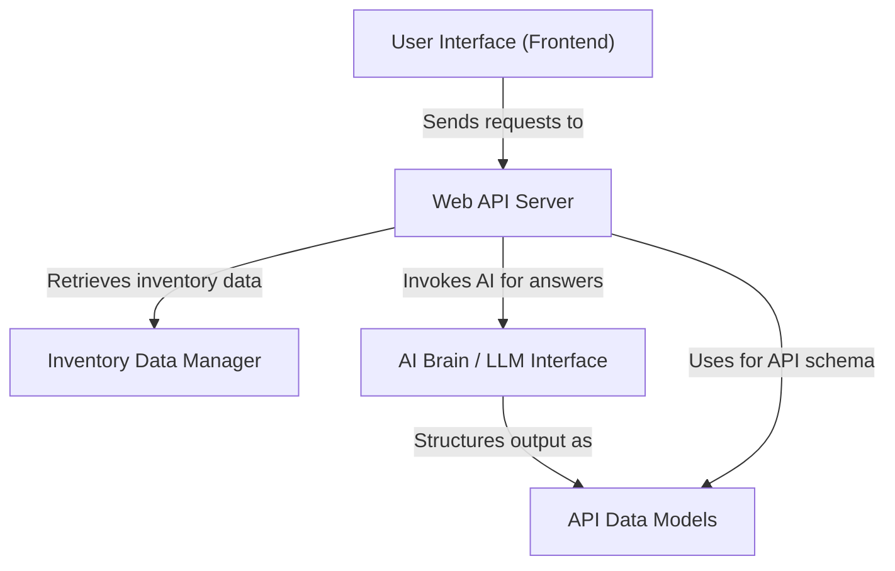

# Quick Start

# 🤖 Inventory AI Chatbot

An AI-powered inventory assistant built with **FastAPI**, **Ollama (Mistral)**, and a lightweight HTML frontend. It lets you query your inventory data in plain English and get structured, insightful responses — in real time via streaming.

---

## ✨ Features

- **Natural language queries** — Ask questions like *"Which items have the lowest stock?"* or *"What's our highest-margin product?"*
- **Streaming responses** — Answers stream token-by-token for a smooth, real-time chat experience
- **Structured JSON output** — Every response includes an `answer`, optional `data`, an `insight`, and a `confidence` rating
- **Inventory stats endpoint** — Instant summary: total items, stock value, average margin, low-stock alerts
- **CSV / Excel support** — Drop in your data file; no code changes needed
- **Fully local** — Runs on your machine via Ollama; no API keys or cloud dependencies

---

## 🗂️ Project Structure

```
chatbot/
├── main.py           # FastAPI app — defines all API routes
├── ai.py             # Ollama integration (streaming + non-streaming)
├── data_loader.py    # Loads CSV/Excel inventory data and computes stats
├── models.py         # Pydantic request/response models
├── index.html        # Frontend chat UI
├── data/
│   └── inventory.csv # Your inventory data file
└── .env              # Environment variables (if any)
```

---

## ⚙️ Prerequisites

- Python 3.9+
- [Ollama](https://ollama.com) installed and running locally
- Mistral model pulled via Ollama

```bash
ollama pull mistral
```

---

## 🚀 Getting Started

**1. Clone the repository**

```bash
git clone https://github.com/SGoD11/chatbot.git
cd chatbot
```

**2. Install dependencies**

```bash
pip install fastapi uvicorn ollama pandas openpyxl
```

**3. Add your inventory data**

Place your inventory file at `data/inventory.csv` (or `.xlsx`). The file should include these columns:

| Column | Description |
|---|---|
| `name` | Item name |
| `category` | Product category |
| `stock` | Current stock quantity |
| `unit` | Unit of measure (e.g. pcs, kg) |
| `buy_price` | Purchase price (₹) |
| `sell_price` | Selling price (₹) |
| `reorder_level` | Stock level that triggers a reorder alert |
| `supplier` | Supplier name |

**4. Start the server**

```bash
uvicorn main:app --reload
```

**5. Open the UI**

Open `index.html` directly in your browser, or serve it from any static file server.

---

## 📡 API Reference

### `POST /ask`
Returns a complete JSON response for a given question.

**Request body:**
```json
{ "question": "Which items are low on stock?" }
```

**Response:**
```json
{
  "answer": "3 items are below their reorder level: ...",
  "data": [],
  "insight": "Consider restocking Category X soon.",
  "confidence": "high"
}
```

---

### `POST /ask/stream`
Same as `/ask` but streams the response as plain text. The frontend accumulates the chunks and parses the final JSON when complete.

---

### `GET /stats`
Returns a quick inventory summary.

```json
{
  "total_items": 42,
  "total_stock_value": 158200.00,
  "avg_margin_pct": 34.5,
  "low_stock_items": ["Item A", "Item B"],
  "top_margin_item": "Item C",
  "categories": ["Electronics", "Apparel"]
}
```

---

### `GET /health`
Health check — confirms the server, model, and data source are configured.

```json
{ "status": "ok", "model": "mistral", "data_source": "csv/excel" }
```

---

## 🔧 Configuration

To switch between CSV and Excel, edit the `DATA_PATH` variable at the top of `data_loader.py`:

```python
DATA_PATH = "data/inventory.csv"   # or "data/inventory.xlsx"
```

The rest of the application requires no changes.

---

## 🛠️ Tech Stack

| Layer | Technology |
|---|---|
| Backend | FastAPI |
| AI / LLM | Ollama + Mistral |
| Data processing | Pandas |
| Frontend | Vanilla HTML/CSS/JS |


---
# Tutorial: chatbot

This project is an **AI-powered chatbot** designed to help users *interact with their inventory data*. It provides a web interface where you can ask natural language questions about your stock, such as "Which items need reordering?". The system then uses a *local large language model* to process these questions and offer intelligent answers and insights, all without sending your data to external services.


## Visual Overview



## Chapters

1. [User Interface (Frontend)
](01_user_interface__frontend__.md)
2. [Web API Server
](02_web_api_server_.md)
3. [Inventory Data Manager
](03_inventory_data_manager_.md)
4. [AI Brain / LLM Interface
](04_ai_brain___llm_interface_.md)
5. [API Data Models
](05_api_data_models_.md)

---


