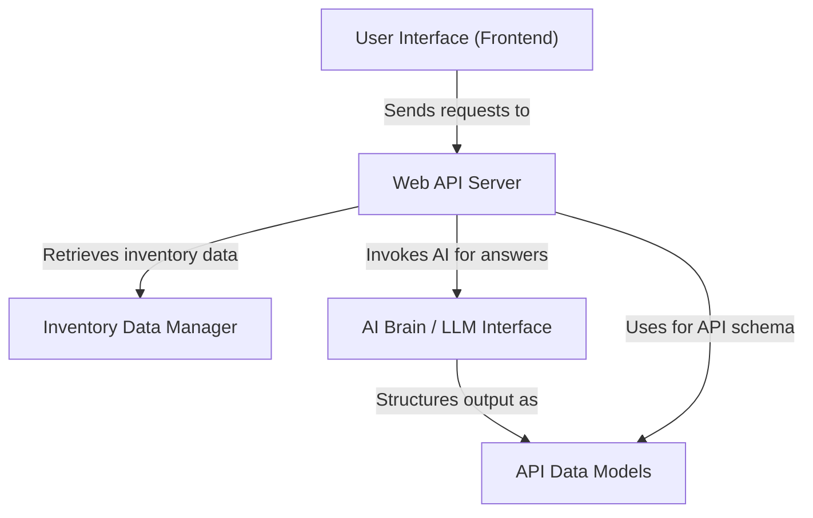

##### [skip to Quick start](00_quick_start.md)

# Tutorial: chatbot

This project is an **AI-powered chatbot** designed to help users *interact with their inventory data*. It provides a web interface where you can ask natural language questions about your stock, such as "Which items need reordering?". The system then uses a *local large language model* to process these questions and offer intelligent answers and insights, all without sending your data to external services.

## Visual Overview

## Chapters

1. [User Interface (Frontend)
](01_user_interface__frontend__.md)
2. [Web API Server
](02_web_api_server_.md)
3. [Inventory Data Manager
](03_inventory_data_manager_.md)
4. [AI Brain / LLM Interface
](04_ai_brain___llm_interface_.md)
5. [API Data Models
](05_api_data_models_.md)

---

